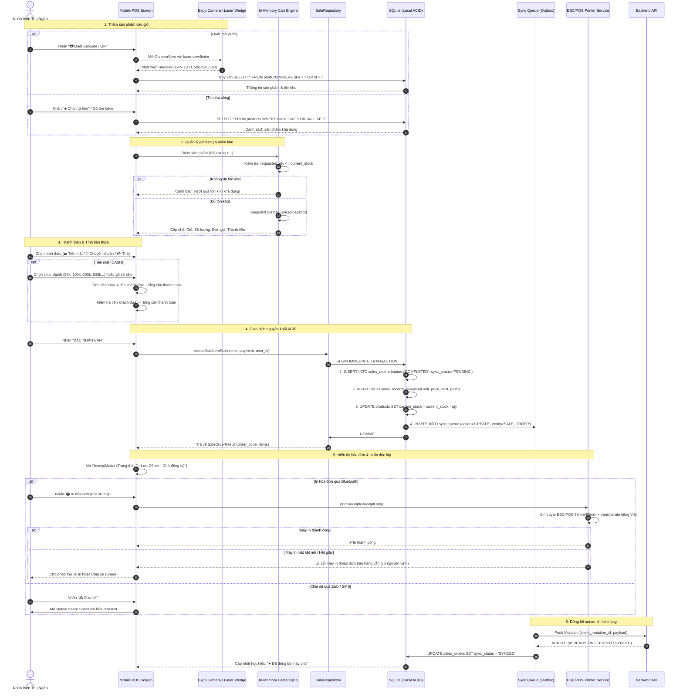

# T_SHOP — PHASE 09 POS FLOW
# OFFLINE-FIRST NATIVE RETAIL CHECKOUT ARCHITECTURE

============================================================
**Project:** T_SHOP  
**Document:** POS End-to-End Operational Lifecycle  
**Date:** September 10, 2026  
============================================================

---

## Các Bất Biến Trọng Tâm (Core Architectural Invariants)

1. **Local Stock Isolation**: Trừ tồn kho local ngay khi commit SQLite để ngăn chặn bán vượt số lượng ngay trên thiết bị.
2. **Server Authoritative**: Server vẫn là nguồn chân lý cho tồn kho tổng; khi sync, server kiểm tra và phân loại conflict nếu có tranh chấp giữa nhiều thiết bị (Phase 07).
3. **Printer Failure Decoupling (Section 36)**: Máy in là thiết bị ngoại vi không tin cậy (untrusted peripheral). Lỗi máy in không được phép trigger rollback database SQLite.
4. **Offline Resilience**: Toàn bộ từ bước 1 đến bước 5 hoạt động 100% khi ngắt kết nối Internet.
